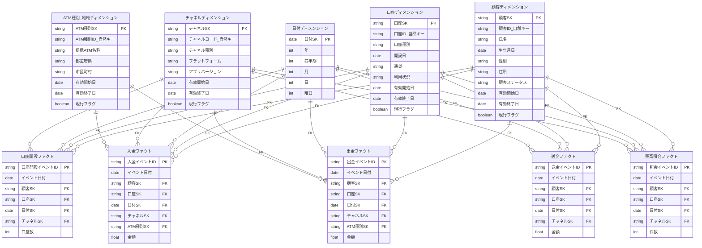

## 5. スター・スキーマのモデリング(第5章)

### 目的
- 第3章（ディメンション定義）と第4章（ファクト定義）で設計した内容を元に、**分析に最適化された論理モデル**を構築する。
- スター・スキーマを用いることで、分析軸（ディメンション）と数値指標（ファクト）の関係を明確にする。

---

### スター・スキーマとは
- **中心にファクトテーブル**（数値指標＋外部キー）
- **周囲にディメンションテーブル**（分析軸の属性）
- OLAP分析やBIツールでのクエリ性能を最大化する構造

---

### 成果物
1. **スター・スキーマER図**（ファクト中心＋周囲にディメンション）
2. **テーブル定義書**  
   - 各ファクト/ディメンションの列、PK/FK、型、説明、粒度、メジャーの可算性、SCD列
3. **適合ディメンション一覧と辞書**  
   - コード表・用語定義・SCDルールを含む最終合意版
---

### 作り方（実務フロー）
1.～3.までは、すでに実施済だが、ビジネス側とのやりとりでアジャイルに修正する
4.以降が実質的なスタースキーマ設計の作業

1. **粒度（Grain）の最終確定**
   - 各ファクトで「1行＝何」を一文で固定  
     例）入金F＝*1入金トランザクション*、口座開設F＝*1開設イベント*。

2. **測定値を確定**
   - 単位・丸め・税込/税抜・手数料の含む/除外を明記  
   - 可算性を分類：加法（入金金額）／半加法（残高=時間に非加法）／非加法（比率）

3. **適合ディメンションの最終確定**
   - 意味・粒度・コード体系・SCD方針（Type1/2/3）を横断合意
   - Unknown/N/A のSK（例：0/-1）を全ディメンションで統一

4. **キー設計・命名規約**
   - すべてのディメンションに **サロゲートキー（SK）** を採用、自然キーは参照列で保持
   - PK/FK名・型・NULL可否・デフォルトを表に落とす。

5. **形状の選択：スター or スノーフレーク**
   - まずはスター（非正規化）で高速化  
   - コード表や巨大階層は必要に応じてスノーフレーク化（正規化）

6. **成果物を出力** 
    - テーブル定義書（列定義・型・説明・可算性・SCD列）
    - スター・スキーマER図
    - データウェアハウスマトリックス
    - 適合ディメンション一覧と辞書
---

## 🎯 ディメンションテーブル定義

### 口座ディメンション
| カラム名 | 型 | 説明 | 属性種別 |
|----------|----|------|----------|
| 口座SK (PK) | 文字列 | サロゲートキー | - |
| 口座ID（自然キー） | 文字列 | 業務システムの口座ID | 自然キー |
| 口座種別 | 文字列 | 普通/貯蓄 | CV |
| 開設日 | 日付 | - | CV |
| 通貨 | 文字列 | JPY 等 | CV |
| 利用状況 | 文字列 | 有効/休眠/解約 | CV/HV |
| 有効開始日 | 日時 | 履歴開始 | HV |
| 有効終了日 | 日時 | 履歴終了 | HV |
| 現行フラグ | 真偽値 | 現行レコード判定 | CV |
| **階層例** | - | 全口座 → 普通預金 → 貯蓄預金 | - |

### 顧客ディメンション
| カラム名 | 型 | 説明 | 属性種別 |
|----------|----|------|----------|
| 顧客SK (PK) | 文字列 | サロゲートキー | - |
| 顧客ID（自然キー） | 文字列 | 業務システムの顧客ID | 自然キー |
| 氏名 | 文字列 | 顧客氏名 | CV/HV |
| 生年月日 | 日付 | - | CV |
| 性別 | 文字列 | 男性/女性 等 | CV |
| 住所 | 文字列 | 都道府県〜番地 | CV/HV |
| 顧客ステータス | 文字列 | 個人/VIP 等 | CV/HV |
| 有効開始日 | 日時 | 履歴開始 | HV |
| 有効終了日 | 日時 | 履歴終了 | HV |
| 現行フラグ | 真偽値 | 現行レコード判定 | CV |
| **階層例** | - | 全顧客 → 個人顧客 → VIP顧客 | - |

### 日付ディメンション
| カラム名 | 型 | 説明 | 属性種別 |
|----------|----|------|----------|
| 日付SK (PK) | 日付 | 日付キー | - |
| 年 | 数値 | 西暦 | - |
| 四半期 | 数値 | 1〜4 | - |
| 月 | 数値 | 1〜12 | - |
| 日 | 数値 | 1〜31 | - |
| 曜日 | 数値 | 0〜6（日曜=0） | - |
| **階層例** | - | 年 → 四半期 → 月 → 日 | - |

### チャネルディメンション
| カラム名 | 型 | 説明 | 属性種別 |
|----------|----|------|----------|
| チャネルSK (PK) | 文字列 | サロゲートキー | - |
| チャネルコード（自然キー） | 文字列 | 業務システムのコード | 自然キー |
| チャネル種別 | 文字列 | スマホアプリ/API | CV |
| プラットフォーム | 文字列 | iOS/Android | CV |
| アプリバージョン | 文字列 | 任意 | 任意 |
| 有効開始日 | 日時 | 履歴開始 | 任意 |
| 有効終了日 | 日時 | 履歴終了 | 任意 |
| 現行フラグ | 真偽値 | 現行レコード判定 | 任意 |
| **階層例** | - | 全チャネル → スマホアプリ → iOS/Android | - |

### ATM種別/地域ディメンション
| カラム名 | 型 | 説明 | 属性種別 |
|----------|----|------|----------|
| ATM種別SK (PK) | 文字列 | サロゲートキー | - |
| ATM種別ID（自然キー） | 文字列 | 業務システムのコード | 自然キー |
| 提携ATM名称 | 文字列 | セブン銀行 等 | CV |
| 都道府県 | 文字列 | ATM設置地域 | CV/HV |
| 市区町村 | 文字列 | ATM設置地域 | CV/HV |
| 有効開始日 | 日時 | 履歴開始 | HV |
| 有効終了日 | 日時 | 履歴終了 | HV |
| 現行フラグ | 真偽値 | 現行レコード判定 | CV |
| **階層例** | - | 全国 → 都道府県 → 市区町村 | - |

---

## 📊 ファクトテーブル定義

### 口座開設ファクト
| カラム名 | 型 | 説明 | 備考 |
|----------|----|------|------|
| 口座開設イベントID (PK) | 文字列 | イベント一意キー | - |
| イベント日時 | 日時 | 発生日時 | - |
| 顧客SK | 文字列 | FK→顧客ディメンション | - |
| 口座SK | 文字列 | FK→口座ディメンション | - |
| 日付SK | 日付 | FK→日付ディメンション | - |
| チャネルSK | 文字列 | FK→チャネルディメンション | - |
| 口座数 | 数値 | 1件ごとの口座数 | 通常=1 |

### 入金ファクト
| カラム名 | 型 | 説明 | 備考 |
|----------|----|------|------|
| 入金イベントID (PK) | 文字列 | イベント一意キー | - |
| イベント日時 | 日時 | 発生日時 | - |
| 顧客SK | 文字列 | FK→顧客ディメンション | - |
| 口座SK | 文字列 | FK→口座ディメンション | - |
| 日付SK | 日付 | FK→日付ディメンション | - |
| チャネルSK | 文字列 | FK→チャネルディメンション | - |
| ATM種別SK | 文字列 | FK→ATM種別/地域ディメンション | ATM経由時のみ |
| 金額 | 数値 | 入金金額 | - |

### 出金ファクト
| カラム名 | 型 | 説明 | 備考 |
|----------|----|------|------|
| 出金イベントID (PK) | 文字列 | イベント一意キー | - |
| イベント日時 | 日時 | 発生日時 | - |
| 顧客SK | 文字列 | FK→顧客ディメンション | - |
| 口座SK | 文字列 | FK→口座ディメンション | - |
| 日付SK | 日付 | FK→日付ディメンション | - |
| チャネルSK | 文字列 | FK→チャネルディメンション | - |
| ATM種別SK | 文字列 | FK→ATM種別/地域ディメンション | - |
| 金額 | 数値 | 出金金額 | - |

### 送金ファクト
| カラム名 | 型 | 説明 | 備考 |
|----------|----|------|------|
| 送金イベントID (PK) | 文字列 | イベント一意キー | - |
| イベント日時 | 日時 | 発生日時 | - |
| 顧客SK | 文字列 | FK→顧客ディメンション | - |
| 口座SK | 文字列 | FK→口座ディメンション | - |
| 日付SK | 日付 | FK→日付ディメンション | - |
| チャネルSK | 文字列 | FK→チャネルディメンション | - |
| 金額 | 数値 | 送金金額 | - |

### 残高照会ファクト
| カラム名 | 型 | 説明 | 備考 |
|----------|----|------|------|
| 照会イベントID (PK) | 文字列 | イベント一意キー | - |
| イベント日時 | 日時 | 発生日時 | - |
| 顧客SK | 文字列 | FK→顧客ディメンション | - |
| 口座SK | 文字列 | FK→口座ディメンション | - |
| 日付SK | 日付 | FK→日付ディメンション | - |
| チャネルSK | 文字列 | FK→チャネルディメンション | - |
| 件数 | 数値 | 照会件数 | 通常=1 |

## スノーフレーク図

## データウェアハウスマトリックス

| ファクトテーブル | データソース(例)       | ファクトタイプ      | 初期値 | 増加量                   | 最大                         | いつ                          | who | what   | where                           | why         |
|---|---|---|---:|---|---|---|---|---|---|---|
| 口座開設ファクト | 勘定系 / KYC            | 取引（イベント）    | 0     | +口座数(=1)              | 期間内の最大開設件数         | 開設イベント日時 / 日付SK     | 顧客 | 口座開設 | スマホアプリ                    | 資産管理/決済 |
| 入金ファクト     | 勘定系 / セブン銀行連携 | 取引（イベント）    | 0     | +金額                    | 期間内の最大入金額           | 入金イベント日時 / 日付SK     | 顧客 | 入金     | セブン銀行ATM／他行振込        | 貯蓄/決済     |
| 出金ファクト     | 勘定系 / セブン銀行連携 | 取引（イベント）    | 0     | −金額                    | 期間内の最大出金額           | 出金イベント日時 / 日付SK     | 顧客 | 出金     | セブン銀行ATM／他行振込        | 資金利用       |
| 送金ファクト     | 勘定系 / 振込GW         | 取引（イベント）    | 0     | −金額（送金元視点）      | 期間内の最大送金額           | 送金イベント日時 / 日付SK     | 顧客 | 送金     | スマホアプリ                    | 支払い/振込   |
| 残高照会ファクト | アプリイベントログ      | イベント（操作ログ）| 0     | +件数(=1)                | 期間内の最大照会件数         | 照会イベント日時 / 日付SK     | 顧客 | 残高照会 | スマホアプリ                    | 資金状況確認   |
